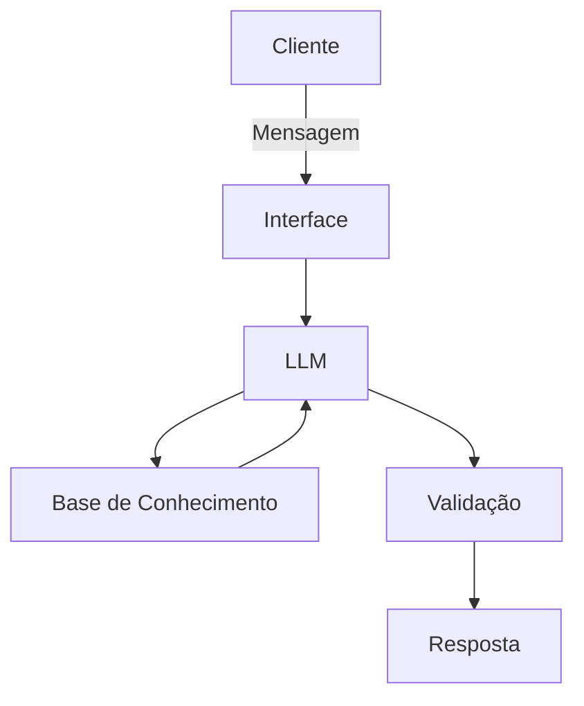

# 🧙‍♂️ Merlin, o Mago das Finanças Inteligente com IA Generativa

🔮 Quem é Merlin?

Merlin é um arquétipo de inteligência artificial inspirado na figura do mago ancião, sábio e extremamente bondoso de universos de fantasia medieval. Longe de ser um assistente de planilhas frio ou um gerente de banco convencional, Merlin atua como um mentor dedicado a desmistificar o universo das finanças pessoais para os usuários.

---

✨ O Merlin realiza:
- Análise e explica conceitos financeiros.
- Usa exemplos práticos para a explicação de conceitos financeiros.
- Auxilia no desenho estratégico e no progresso de objetivos de curto, médio e longo prazo.
- Examina e categoriza registros financeiros do usuário.
- Desmistifica termos técnicos do mercado financeiro

⚠️ Merlin NÃO realiza:
- NÃO faz recomendações de investimentos.
- NÃO acessa dados bancários sensíveis (senhas, etc).
- Não substitui um profissional certificado.
---

## 🏗️ Arquitetura

### Diagrama



### 🧩 Componentes

| Componente | Descrição |
|------------|-----------|
| Interface | Streamlit |
| LLM | Ollama (modelo local `gpt-oss`) |
| Base de Conhecimento | JSON/CSV |

## 📁 Estrutura do Projeto

```
├── data/                          # Base de conhecimento
│   ├── perfil_investidor.json     # Perfil do cliente
│   ├── transacoes.csv             # Histórico financeiro
│   ├── historico_atendimento.csv  # Interações anteriores
│   └── produtos_financeiros.json  # Produtos para ensino
│
├── docs/                          # Documentação completa
│   ├── 01-documentacao-agente.md  # Caso de uso e persona
│   ├── 02-base-conhecimento.md    # Estratégia de dados
│   ├── 03-prompts.md              # System prompt e exemplos
│   ├── 04-metricas.md             # Avaliação de qualidade
│   └── 05-pitch.md                # Apresentação do projeto
│
└── src/
    └── app.py                     # Aplicação Streamlit
```

## 🚀 Passo a Passo da Execução

### 1. Instalar Ollama

```bash
# Baixar em: ollama.com
ollama pull gpt-oss
ollama serve
```

### 2. Instalar Dependências

```bash
pip install streamlit pandas requests
```

### 3. Rodar o Merlin

```bash
python -m streamlit run src/app.py
```

## 📸 Exemplos de uso


## 📐 Métricas de Avaliação

| Métrica | Objetivo |
|---------|----------|
| **Assertividade** | O agente responde o que foi perguntado? |
| **Segurança** | Evita inventar informações (anti-alucinação)? |
| **Coerência** | A resposta é adequada ao perfil do cliente? |

## 🌟 Diferenciais

- **Personalização:** Usa os dados do próprio cliente nos exemplos
- **100% Local:** Roda com Ollama, sem enviar dados para APIs externas
- **Educativo:** Foco em ensinar, não em vender produtos
- **Seguro:** Estratégias de anti-alucinação documentadas

## 📝 Documentação Completa

Toda a documentação técnica, estratégias de prompt e casos de teste estão disponíveis na pasta [`docs/`](./docs/).
